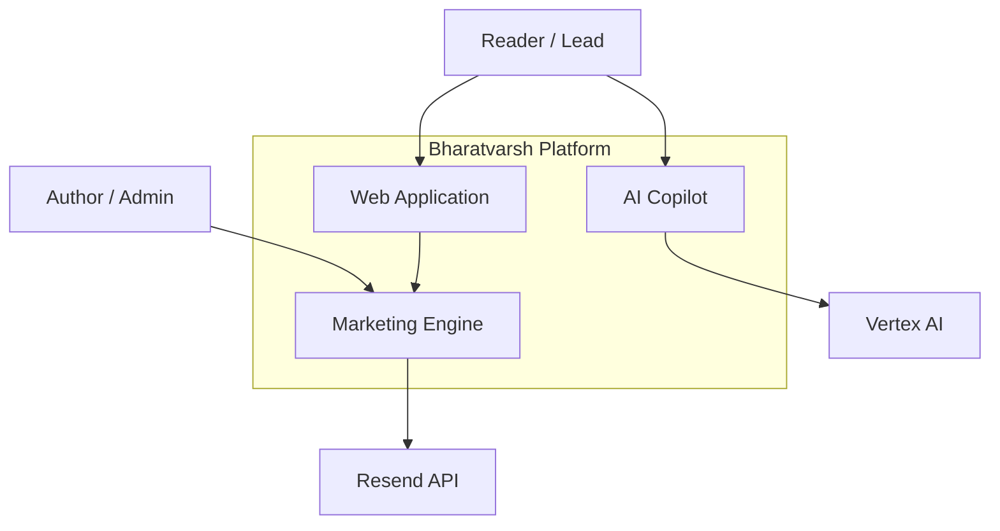
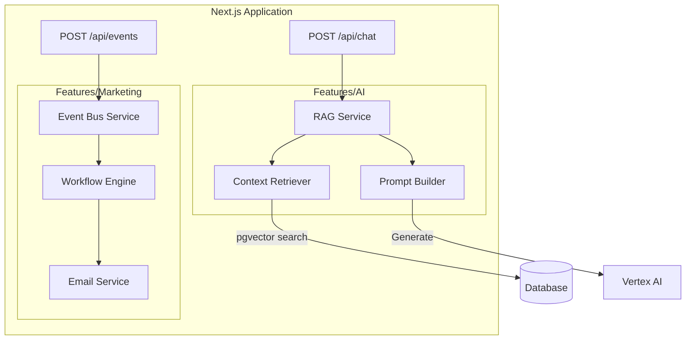

# Bharatvarsh CX/Marketing SaaS Architecture Design

## 1. Executive Summary
This design transforms the current platform into a robust CX/Marketing SaaS tool without disrupting existing functionality.
**Core Philosophy:** "Scale-to-Zero" Event-Driven Architecture.
**Stack:** GCP Cloud Run (Compute), Cloud SQL (Data + Vectors), Cloud Tasks (Async Events), Vertex AI (Intelligence).

## 2. Requirements

### Functional Requirements
1.  **Event-Driven Tracking**: Capture user actions (e.g., "Read Chapter 1", "Downloaded Map", "Spent 5 mins on page").
2.  **Marketing Funnel Automation**: Trigger email sequences via Resend based on events (e.g., "Welcome Series", "Abandonment Recovery").
3.  **AI Copilot ("Bhoomi")**: A context-aware chatbot that answers questions about the novel's world using RAG (Retrieval-Augmented Generation).
4.  **Lead Scoring**: Assign dynamic scores to users based on engagement to identify "High Interest" leads.

### Non-Functional Requirements
1.  **Cost Efficiency**: Architecture must minimize fixed costs. (Solution: Cloud Run + Gemini Flash + pgvector).
2.  **Modularity**: New features must use the `src/features/*` pattern and not tangle with core forum logic.
3.  **Scalability**: Handle spikes in traffic (e.g., marketing campaign launch) without manual intervention.

## 3. Solution Architecture (C4 Model)

### C1: System Context


### C2: Container Diagram (GCP Stack)
```mermaid
graph TB
    Client[Browser / React App]
    
    subgraph "Google Cloud Platform"
        Ingress[Cloud Run Ingress (Free)]
        
        subgraph "Cloud Run"
            NextJS[Next.js Server]
            Worker[Async Worker API]
        end
        
        subgraph "Data Persistence"
            DB[(Cloud SQL PostgreSQL)]
            Vector[(pgvector Embeddings)]
        end
        
        subgraph "Async & AI"
            Queue[Cloud Tasks]
            Vertex[Vertex AI Gemini 1.5 Flash]
        end
    end

    Client --HTTPS--> Ingress
    Ingress --> NextJS
    
    NextJS --Writes Event--> DB
    NextJS --Enqueues Task--> Queue
    
    Queue --Triggers--> Worker
    Worker --Reads/Writes--> DB
    Worker --GenAI--> Vertex
    
    DB -. includes .- Vector
```

### C3: Component Diagram (Marketing & AI)


## 6. Design Decisions & Q/A

### Why "Clean" Cloud Run Ingress? (No Paid Load Balancer)
**Question:** Do we need a paid Load Balancer?
**Decision:** **No.** We will use the **built-in Cloud Run Ingress**.
-   **Cost**: $0.
-   **Functionality**: Provides HTTPS termination, traffic splitting (for canary deployments), and automatic scaling.
-   **Why it was in the diagram**: It represented the entry point, but we will strictly avoid the "Global External Load Balancer" resource ($18+/mo) until you have massive multi-region traffic.

### Marketing Engine Alternatives
**Question:** Most cost-friendly & GCP-aligned way to build marketing campaigns?
**Analysis**:
1.  **Resend (Recommended)**:
    -   **Alignment**: Built specifically for React/Next.js (your stack). Best DX.
    -   **Cost**: Free for 3,000 emails/mo. $20/mo thereafter.
    -   **GCP Alignment**: External API, but reliable.
2.  **SendGrid (GCP Marketplace Partner)**:
    -   **Alignment**: Native GCP billing integration.
    -   **Cost**: Free for 100 emails/day.
    -   **Pros**: Industry standard, highly reliable.
    -   **Cons**: Old-school templates, harder to integrate seamlessly with Next.js components.
3.  **Firebase Extensions (Trigger Email)**:
    -   **Alignment**: Native Google ecosystem.
    -   **Cost**: Usage-based (fires Cloud Functions).
    -   **Cons**: Extremely limited "Marketing" capabilities (mostly transactional). Hard to build "Campaigns".

**Verdict**: Stick with **Resend** for the **Developer Experience + Free Tier**. It allows you to code emails in React (keeping your project uniform) rather than learning a proprietary drag-and-drop tool on SendGrid.

## 4. Implementation Plan

### Phase 1: Foundation & Event Bus
1.  **Database**: Enable `pgvector` extension on Cloud SQL. Create `Events` and `VectorStore` tables.
2.  **Event Ingestion**: Create a unified `track(event, payload)` API in Next.js.
3.  **Async Infrastructure**: Set up **Google Cloud Tasks** queue to handle background jobs (prevents user lag).

### Phase 2: AI Copilot ("Bhoomi")
1.  **Ingestion**: Build a script to chunk "Seed Files" (`Canon Lore`, `Timeline`, etc.) and generate embeddings via Vertex AI.
2.  **Storage**: Store embeddings in Cloud SQL (`vector` column) with **Metadata Tags** (`spoiler_tier`, `type`, `year`).
3.  **Chat Interface**: Build a floating "Copilot" UI component with Spoiler Mode toggles.
4.  **Backend**: Implement RAG pipeline:
    -   **Search**: Query Vector DB with metadata filters (Default: `spoiler:S1`).
    -   **Prompt**: Inject `Bhoomi System Prompts.txt`.
    -   **Generate**: Call Gemini 1.5 Flash.

### Phase 3: Marketing Automation
1.  **Workflow Engine**: Simple rule engine (e.g., `IF event == 'signup' THEN send_email('welcome')`).
2.  **Integration**: Connect to **Resend** for transactional/marketing emails.
3.  **Analytics Dashboard**: Minimal view for Admin to see "Top Leads" and "Recent Events".

## 5. Cost Optimization Strategy
-   **AI**: Use **Gemini 1.5 Flash** (extremely cheap, high speed) instead of Pro.
-   **Vector DB**: Use **pgvector** on existing Postgres. Avoid dedicated vector databases like Pinecone or Vertex Vector Search (saving ~$70-100/mo).
-   **Compute**: Next.js and Workers run on same Cloud Run instance (or separate services scaling to zero).

This architecture transforms Bharatvarsh into a smart, automated platform while keeping costs aligned with a solo-founder budget.
